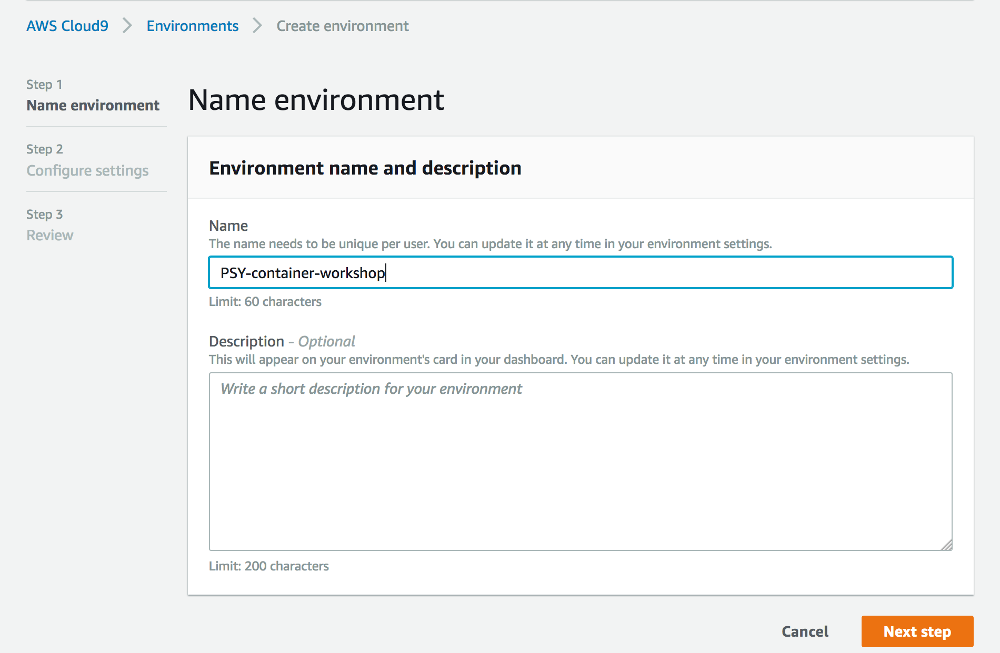
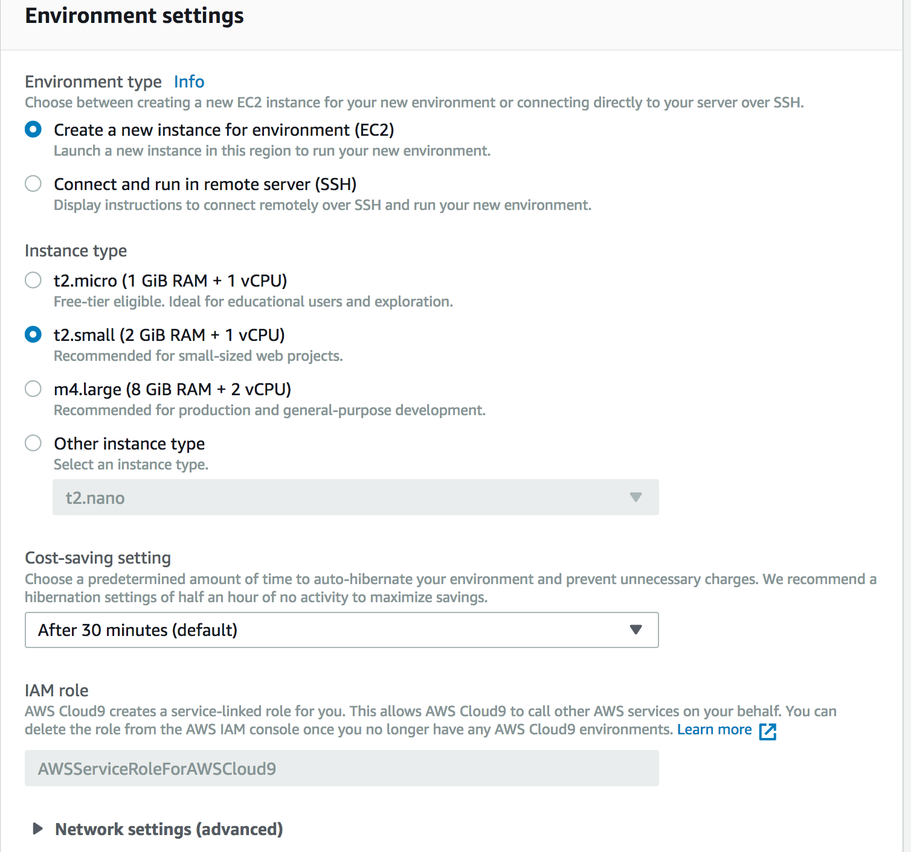

## Preparing a your Lab environment

- This module is for configuring your dev environment
- We will show the set up process of Cloud9 Env and Node Develpoment environment.
- Cloud 9 is recommended as your dev IDE for studying this workshop

## 1. Using Cloud9

### 1.1. Create your Cloud9 environments

##### Launch your instance

- Use the Singapore region!

1.  Specify Environment name : "YOUR INITIAL-workshop"



2.  Select "Create a new instance"
3.  Select "t2.small"

 4. Review and launching your environment

##### Open your environment


### 1.2 Update your environment

1.  Run the yum update command to help ensure the latest security updates and bug fixes are installed

```
$ sudo yum -y update
```

2.  Run this command to install the latest version of Node.js.

```
$ nvm install node
```

reference : "Node.js Sample for AWS Cloud9" https://docs.aws.amazon.com/cloud9/latest/user-guide/sample-nodejs.html

### 1.3 Create a CodeCommit repository

1.  Run this command to create a repository in Singapore region

```
$aws codecommit create-repository --repository-name <your repo name> --region ap-southeast-1

{
    "repositoryMetadata": {
        "repositoryName": "beanstalkcicd",
        "cloneUrlSsh": "ssh://git-codecommit.ap-southeast-1.amazonaws.com/v1/repos/beanstalkcicd",
        "lastModifiedDate": 1533019196.993,
        "repositoryId": "e9165142-67bb-4dfc-b9e6-bfdc41043b4a",
        "cloneUrlHttp": "https://git-codecommit.ap-southeast-1.amazonaws.com/v1/repos/beanstalkcicd",
        "creationDate": 1533019196.993,
        "Arn": "arn:aws:codecommit:ap-southeast-1:973312664023:beanstalkcicd",
        "accountId": "973312664023"
    }
}
```

2.  Configure Git credential helper included in the AWS CLI. The credential helper allows Git to use HTTPS and a cryptographically signed version of your IAM user credentials or Amazon EC2 instance role whenever Git needs to authenticate with AWS to interact with AWS CodeCommit repositories.

```
$ git config --global credential.helper '!aws codecommit credential-helper $@'
$ git config --global credential.UseHttpPath true
```

3.  Clone the repository

```
$ git clone <your repo's cloneUrlHttp>

Cloning into 'beanstalkcicd'...
warning: You appear to have cloned an empty repository.
```

4.  Initialise git repository

```
$ git init

Initialized empty Git repository in /home/ec2-user/environment/.git/
```

### 1.4 Configure your Node environment

1.  Check node version and check the location of Node

```
$ node -v
v10.7.0

$ which node
~/.nvm/versions/node/v10.7.0/bin/node
```

2.  Run this command to initialise Node project, accept all defaults by hitting **enter** 10 times

```
$ npm init

This utility will walk you through creating a package.json file.
It only covers the most common items, and tries to guess sensible defaults.

See `npm help json` for definitive documentation on these fields
and exactly what they do.

Use `npm install <pkg>` afterwards to install a package and
save it as a dependency in the package.json file.

Press ^C at any time to quit.
package name: (environment)
version: (1.0.0)
description:
entry point: (hello.js)
test command:
git repository:
keywords:
author:
license: (ISC)
About to write to /home/ec2-user/environment/package.json:

{
"name": "server",
"version": "1.0.0",
"description": "**\_ \_\_\_\_** \_**\_ \_ \_ \_** / \\ \\ / / **_| / _**| | **\_ \_ \_ **| |/ _ \\ / _ \\ \\ /\\ / /\\_\_\_ \\ | | | |/ _ \\| | | |/ _` | (_) | "main": "hello.js",
"dependencies": {
"nodemon": "^1.18.3"
},
"devDependencies": {},
"scripts": {
"test": "echo \"Error: no test specified\" && exit 1"
},
"author": "",
"license": "ISC"
}

Is this OK? (yes)
```

### 1.5 Install Express Framework for Node, we'll be using it to create simple REST APIs

1.  Run this command to install the latest version of Express framework for Node. We'll be using it to create simple REST APIs

```
$ npm install express --save
```

We're done, continue to [Lab 1 : Create a sample Node API](./doc-module-01.md)
