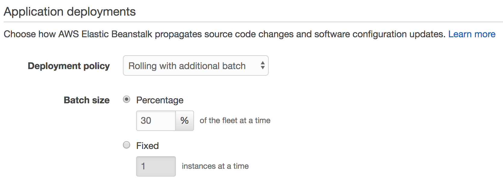
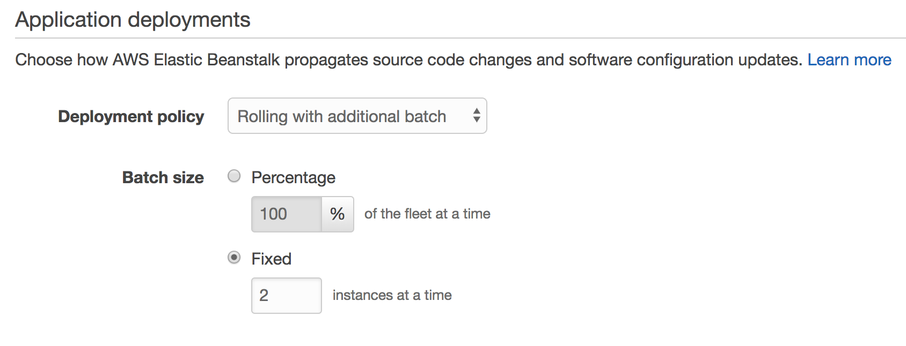

## Deployment with Elastic Beanstalk Command (EB) Line Interface (CLI)

### 1. Setup EB CLI

#### 1.1 Install EB CLI

1.  Run this command to install EB CLI

```
$ pip install awsebcli --upgrade --user
```

2.  Verify EB CLI is installed

```
$ eb --version

EB CLI 3.14.3 (Python 2.7.1)
```

#### 1.2 Configure EB CLI

1.  Initialise your Git repository

```
$ git init

Initialized empty Git repository in /home/ec2-user/environment/beanstalk-workshop/.git/
```

EB CLI will now recognize that your application is set up with Git.

2.  Initialise EB application

```
$ eb init
```

2.  Enter **7** to select Singapore region

```
Select a default region
1) us-east-1 : US East (N. Virginia)
2) us-west-1 : US West (N. California)
3) us-west-2 : US West (Oregon)
4) eu-west-1 : EU (Ireland)
5) eu-central-1 : EU (Frankfurt)
6) ap-south-1 : Asia Pacific (Mumbai)
7) ap-southeast-1 : Asia Pacific (Singapore)
8) ap-southeast-2 : Asia Pacific (Sydney)
9) ap-northeast-1 : Asia Pacific (Tokyo)
10) ap-northeast-2 : Asia Pacific (Seoul)
11) sa-east-1 : South America (Sao Paulo)
12) cn-north-1 : China (Beijing)
13) cn-northwest-1 : China (Ningxia)
14) us-east-2 : US East (Ohio)
15) ca-central-1 : Canada (Central)
16) eu-west-2 : EU (London)
17) eu-west-3 : EU (Paris)
(default is 3): 7
```

3.  Enter **beanstalk-workshop** as application name

```
Enter Application Name
(default is "beanstalk-workshop"): beanstalk-workshop
```

4.  Enter **Y** to select Node.js platform

```
It appears you are using Node.js. Is this correct?
(Y/n): Y
```

5.  Enter **y** to continue with CodeCommit with Elastic Beanstalk

```
WARNING: Git is in a detached head state. Using branch "default".
Note: Elastic Beanstalk now supports AWS CodeCommit; a fully-managed source control service. To learn more, see Docs: https://aws.amazon.com/codecommit/
Do you wish to continue with CodeCommit? (y/N) (default is n): y
```

6.  Enter **1** to create a new CodeCommit repository

```
Select a repository
1) [ Create new Repository ]
(default is 1): 1
```

Enter a name for your repository, I've chosen **"beanstalk-workshop"** in the following example

```
Enter Repository Name
(default is "origin"):  beanstalk-workshop
```

Enter a name for your branch, I've chosen **"default"** in the following example

```
Enter Branch Name
***** Must have at least one commit to create a new branch with CodeCommit *****
(default is "default"): default
```

6.  Enter **n** when prompted to setup SSH access

```
Cannot setup CodeCommit because there is no Source Control setup, continuing with initialization
Do you want to set up SSH for your instances?
(Y/n): n
```

#### 1.3 Commit application to repository

1.  Add and commit changes

```
$ git add .

$ git commit -m "first commit"
```

#### 1.4 Create EB environment

1.  Run eb create command to create an EB environment

```
$ eb create sample-node-env1 --elb-type application
```

1.  Create a cluster
    

2)  Select linux cluster


3.  Specify Cluster configuration

- Cluster Name : Java-cluster
- EC2 instance type : m5.large
- Number of instances : 2
- Key Pair : select your key pair


- VPC : default VPC
- Subnets : Select 2 subnets
- Security Group : Create a new security Group **OPEN ALL PORT** , it is very important
- Role : Select a EC2 instance role to support your Task (need to create a new role)

- Need to Open all port in Security group, for dynamic port mapping of ALB


3.  Create a Resources
    if you have error on creating IAM Role for instance, then create a role for ECS Instance Role and execute it again.

#### 1.4 Create a ALB

1.  Create a ALB

- Specify name : <your initial>-alb-ecs-cluster
- Select the VPC which ECR is running on :
- Select all AZs


2.  Create a security group

- Speficy name : <your initial>-alb-sg-default
- Open all TCP


3.  Configure a default target group

- Specify name : <your initial>--alb-ecs-cluster-default-tg
- Select Instance as target type


4.  Skip target registration
    Don't register target instances here.


#### 1.5 Create Task definition

1.  Specify information

- Task Definition Name : <Your-Inital>-psy-contianer-task-hello
- Task Role : Creat a Amazon Elastic Container Service Task Role in IAM Role

- Add : S3, DyanmoDB, Watch logs, RDS, Rekognition, Translate
  

* Network Mode : Bridge
* Task memory (MiB) : 512
* Task CPU (unit) : 1 vcpu


2.  Specify container information

- **Container name** : **java-container**
- **Image** : <YOUR ECR image ARN> (for example, <account-id>.dkr.ecr.ap-southeast-1.amazonaws.com/java-workshop )
- Memory Limits (MiB) : 128
- Port mapping : 0 : 8080
- important !!! you need to specify host port as empty


3.  Create a Task
    Check a created task

#### 1.6 Create Service definition

1.  Configure service

- Task Definition : Select a task you created in task definition (<your initial>-psy-container-task-hello)
- Cluster : select the cluster (container-workshop)
- Service name : java-service
- Number of tasks : 1
- Minimum healthy percent : 50
- Maximum percent : 200

- Placement Templates : AZ Balanced spread


2.  Configure network

- Select a ALB you crated
- Specify Listner port : 80 HTTP
- Select "Create New" as target group name
- Specify Path pattern : /
- Specify Evaluation Order : 1



3.  Cofigure autoscaling

- None



#### 1.7 Add one more service

- Specify Path Pattern : /workshop/users\*
- Add ALB target group
- Add health Check : /workshop/users/all

#### Confgratulation! You added 2 services in your ECS cluster.

<hr>
<hr>

### 2. Create a ECS cluster using CloudFormation

Use :
https://github.com/aws-samples/ecs-refarch-cloudformation

Lauch a whole stack. and test it(see output of CloudFormation)

### 1. Customize the templates

1.  (Recommendataion) download a zip file from
    https://github.com/aws-asean-builders/aws-container-workshop/tree/master/lab-03/cloudformation/original

and Unzip it.

1.  (Optional) Clone the forked GitHub repository to your local machine.

```
git clone https://github.com/aws-samples/ecs-refarch-cloudformation.git
```

2.  Modify the templates.
3.  Upload them to an Amazon S3 bucket of your choice. Upload master.yml, template, service foders

- master.yml

  +- infrastructure/\*

  +- services/\*

4.  Either create a new CloudFormation stack by deploying the master.yaml template, or update your existing stack with your version of the templates.

5)  Change master.yml to point out your file location.

### 2. Lauch the stack with CloudFormaton

<hr>
<hr>

### 3. Create a ECS cluster using ECS-CLI (Optional)

1.  Install ecs-cli :
    https://docs.aws.amazon.com/AmazonECS/latest/developerguide/ECS_CLI_installation.html

Create an ECS cluster with these resources:

1.  Create a infrastructure using Cloudformation

- Use **templates/infra.yaml**

```
cd templates

aws cloudformation deploy \
 --stack-name aws-infra-ecscli \
 --template-file infra.yaml \
 --region ap-southeast-1 \
 --capabilities CAPABILITY_IAM
```

```
aws cloudformation deploy \
 --stack-name aws-ecs-ec2 \
 --template-file master.yaml \
 --region ap-southeast-1 \
 --capabilities CAPABILITY_IAM
```

2.  Run the follow command to capture the output from the CloudFormation template as key/value pairs in the file ecs-cluster.props.

```
aws cloudformation describe-stacks \
 --region ap-southeast-1 \
 --stack-name aws-infra-ecscli \
 --query 'Stacks[0].Outputs' \
 --output=text | \
 perl -lpe 's/\s+/=/g' | \
 tee ecs-cluster.props
```

3.  Setup the environment variables using the file (ecs-cluster.props)

```
set -o allexport
source ecs-cluster.props
set +o allexport
```

4.  Configure ECS CLI

```
ecs-cli configure --cluster $ECSCluster --region ap-southeast-1
```

5.  Create the task definition parameters for each of the service:

```
ecs-params-create.sh greeting
```

6.  Start the greeting service up:

```
ecs-cli compose --verbose \
 --file greeting-docker-compose.yaml \
 --task-role-arn $ECSRole \
 --ecs-params ecs-params_greeting.yaml \
 --project-name greeting \
 service up \
 --target-group-arn $GreetingTargetGroupArn \
 --container-name greeting-service \
 --container-port 8081
```

```

```

```

```
