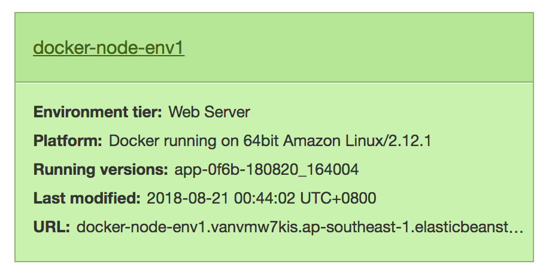

## Lab 3 : Create & Deploy Your First Docker Image

- Use a Lab-01 source and images to complete this lab.

### 1. Containerising our Node Application

#### 1.1. Create a Dockerfile

1.  Create a **Dockerfile**, and edit it in the IDE

```
$ touch ~/environment/beanstalk-workshop/Dockerfile
```

Add the following configuration to the Dockerfile

````
FROM node:alpine

# Create app directory
WORKDIR /usr/src/app

# Install app dependencies
COPY package*.json .

RUN npm install

# Bundle app source
COPY . .

EXPOSE 8080

CMD [ "npm", "start" ]
```

2.  Clone your git repo
````

git clone <your repo URL>

```


3.  Push your first code
```

cd <your repo directory>
vi Readme.md

git add .
git commit -m "first"
git push

```
#### 1.2. Commit a source to new CodeCommit repository

1.  Copy your sorce codes into your project derectory you careated above step
```

cp -R ~/environment/aws-container-workshop/lab-01/\* ~/environment/<your-repo>

```
2.  Commit source code
```

git add .
git commit -m "first"
git push

```
#### 1.3 Create CodeBuild Service Role for docker images

1.  Give a full CloudWatch Write privilege
2.  Give a full ECR privilege
3.  Give a full S3 access privilege
4.  Give a full CodeCommit access

Create a policy "CodeBuild-Build-Policy"
Create a Role for CodeBuil and attach above policy
```

{
"Version": "2012-10-17",
"Statement": [
{
"Effect": "Allow",
"Action": [
"ecs:*",
"ecr:*",
"s3:*",
"codecommit:*",
"autoscaling:Describe*",
"cloudwatch:*",
"logs:*",
"sns:*"
],
"Resource": "\*"
}
]
}

```
### 2. Create a builder project for a docker image

refer : https://docs.aws.amazon.com/codebuild/latest/userguide/sample-docker.html

- There is 2 builder json file. create-dock-builder.json and create-java-builder.json
- create-java-builder.json is a file for creating CodeBuild for compiling and packaging Java source code to JAR output file.
- create-dock-builder.json is a file for creating CodeBuild for creating docker images

#### 2.1. Change Builder files

1.  Change the values accoriding to your environments
2.  CodeCommit URL, region-ID, account-ID,Amazon-ECR-repo-name and role-name ARN
```

{
"name": "sample-docker-project",
"source": {
"type": "CODECOMMIT",
"location": "<YOUR code commit URL>"
},
"artifacts": {
"type": "NO_ARTIFACTS"
},
"environment": {
"type": "LINUX_CONTAINER",
"image": "aws/codebuild/docker:17.09.0",
"computeType": "BUILD_GENERAL1_SMALL",
"environmentVariables": [
{
"name": "AWS_DEFAULT_REGION",
"value": "region-ID"
},
{
"name": "AWS_ACCOUNT_ID",
"value": "account-ID"
},
{
"name": "IMAGE_REPO_NAME",
"value": "Amazon-ECR-repo-name"
},
{
"name": "IMAGE_TAG",
"value": "latest"
}
]
},
"serviceRole": "arn:aws:iam::account-ID:role/role-name"
}

```
#### 2.2. Create a builder project

1.  Create a Java builder
```

aws codebuild create-project --cli-input-json file://create-java-builder.json

```
2.  Create a docker builder
```

aws codebuild create-project --cli-input-json file://create-dock-builder.json

```
#### 2.3 Change buildspec.yml

#### 2.4. Start Build

- Run each CodeBuild, first, java builder then run docker builder

1.  In your Codebuild Console, click a Start Build Button



    2. Select master branch


#### 2.5. Check Your Roles for CoudeBuild

If there is a failure, check your build result and if your role dosn't have enough privilege then add more access privilege on access policy.

1.  Give a full CloudWatch Write privilege
2.  Give a full ECR privilege

#### 2.6. Check pushed image in your local machine

1.  You can describle the iamges withing a repository with following command.
```

aws ecr describe-images --repository-name java-workshop

```
2.  Pull the image using the docker pull
```

docker pull <aws_account_id>.dkr.ecr.<your_region>.amazonaws.com/java-workshop:latest

docker pull 550622896891.dkr.ecr.ap-southeast-1.amazonaws.com/java-workshop:latest

docker images

docker run -d -p 80:8080 --name=hello-world <IMAGE_ID>

docker run -d -p 80:8080 --name=hello-world 6f9c0d0b1c56

docker ps

```
### 3 Create a CICD for docker (new cluster)

https://docs.aws.amazon.com/AmazonECS/latest/developerguide/ecs-cd-pipeline.html

#### 3.1 Add imagedefinition.json in your root directory of source codes

- name is the container name you defined in task definition
```

[
{
"name": "java-container",
"imageUri": "550622896891.dkr.ecr.ap-southeast-1.amazonaws.com/java-workshop"
}
]

```
### 4. Complete a CI/CD

#### 4.1 Add deploy stage

1.  Add deploy stage in your CI/CD

- Action category: Deploy
- Action name : Specify your service name
- Deployment provide : Amazon ECS
- Cluster name : Java-cluster (Specify your cluster name you created)
- Service name : java-service (Select service name you created )
- Image filename : imagedefinition.json (The file name you added in previous step)
- Input artifacts : Specify the artifact name of previous stage


#### 4.2 Deploy your application

1.  Change code and deploy it


<hr>
<hr>

### Lab 3-2 : Update your stack with CloudFormation (Continue from Lab 2, section 2)

- ECS has the ability to perform rolling upgrades to your ECS services to minimize downtime during deployments. For more information, see Updating a Service.

- To update one of your services to a new version, adjust the Image parameter in the service template (in services/\* to point to the new version of your container image.

- After you've updated the template, update the deployed CloudFormation stack; CloudFormation and ECS handle the rest.

### 1. Create a new services definition

1.  Add user-service folder under **service**
2.  Copy antoher service.yml to user-service

### 2. Modify a service.yml

1.  Update the ContainerName and Image parameters

2.  Increment the ListenerRule priority number (no two services can have the same priority number - this is used to order the ALB path based routing rules).

3.  Change TaskDefinition field to create a task definition
```

            LoadBalancers:
                - ContainerName: "user-service"
                  ContainerPort: 8080

```

```

    TaskDefinition:
        Type: AWS::ECS::TaskDefinition
        Properties:
            Family: user-service
            ContainerDefinitions:
                - Name: user-service
                  Essential: true
                  Image: <your id>.dkr.ecr.ap-southeast-1.amazonaws.com/java-spring-app
                  Memory: 1024
                  PortMappings:
                    - ContainerPort: 8080

```

```

            HealthCheckPath: /workshop/users/all

```

```

    ListenerRule:
        Type: AWS::ElasticLoadBalancingV2::ListenerRule
        Properties:
            ListenerArn: !Ref Listener
            Priority: 3

```
### 2. Update master.yml

1.  Add a new service
```

    UserService:
        Type: AWS::CloudFormation::Stack
        Properties:
            TemplateURL: https://s3-ap-southeast-1.amazonaws.com/<your bucket>/ecs-cloudformation/services/user-service/service.yaml
            Parameters:
                VPC: !GetAtt VPC.Outputs.VPC
                Cluster: !GetAtt ECS.Outputs.Cluster
                DesiredCount: 2
                Listener: !GetAtt ALB.Outputs.Listener
                Path: /workshop/users*

```

```

Outputs:

    ServiceServiceUrl:
        Description: The URL endpoint for the product service
        Value: !Join [ "/", [ !GetAtt ALB.Outputs.LoadBalancerUrl, "workshop/users/all" ]]

```

```
